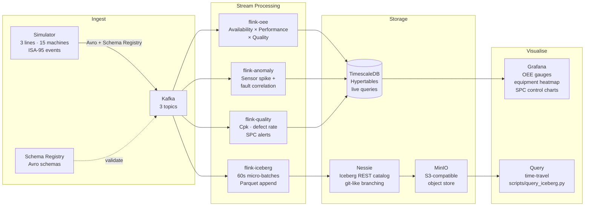

# ISA-95 Real-Time Manufacturing OEE Dashboard

[](https://github.com/dharmesh-data/isa95-oee-dashboard/actions/workflows/ci.yml)
[](https://codecov.io/gh/dharmesh-data/isa95-oee-dashboard)
[](LICENSE)
[](https://github.com/dharmesh-data/isa95-oee-dashboard/pkgs/container/isa95-oee-dashboard%2Fsimulator)

Real-time OEE (Overall Equipment Effectiveness) analytics platform modelled on the ISA-95 manufacturing hierarchy. Simulates 3 production lines and 15 machines, streams Avro events through Kafka, computes OEE + anomaly detection in Python, writes live metrics to TimescaleDB, and persists historical data to Apache Iceberg via Nessie + MinIO. One `make dev` gets you running locally.

---

## Architecture



**Data flow:**
1. Simulator publishes `line-events`, `equipment-status`, `quality-metrics` to Kafka (Avro, Schema Registry validated)
2. Three Flink jobs consume in parallel — OEE calculator, anomaly detector, quality monitor
3. Results land in TimescaleDB hypertables; Grafana polls every 5 s
4. `flink-iceberg` writes 60-second micro-batches to Parquet files in MinIO, catalogued by Nessie
5. `scripts/query_iceberg.py` can time-travel to any past snapshot

---

## Dashboards

| Dashboard | What it shows |
|-----------|---------------|
| **OEE Overview** | Live OEE gauge per line, availability / performance / quality breakdown, shift trend |
| **Equipment Health** | Machine-level status heatmap, fault frequency, sensor sparklines (temp, vibration, power) |
| **Quality / SPC** | Defect rate trend, Cpk gauge, X-bar control chart with ±3σ UCL/LCL bands |

All three auto-refresh at 5 s. Default login: `admin / admin`.

---

## Prerequisites

- Docker ≥ 24 with Compose v2 (`docker compose version`)
- 4 GB free RAM (8 GB recommended for all profiles)
- Python 3.11+ (only for `make register-schemas` — uses a local venv)
- `make`

---

## Quick Start

```bash
git clone https://github.com/dharmesh-data/isa95-oee-dashboard.git
cd isa95-oee-dashboard
make dev                   # starts core stack, creates topics, registers Avro schemas
make run-simulator         # starts event generator
make run-flink             # starts OEE, anomaly, quality + Iceberg jobs
```

| Service | URL | Credentials |
|---------|-----|-------------|
| Grafana | http://localhost:3000 | admin / admin |
| Kafka UI | http://localhost:8080 | — |
| Schema Registry | http://localhost:8081 | — |
| TimescaleDB | localhost:5432 | postgres / changeme |
| MinIO Console | (internal) | minioadmin / minioadmin |

Check the simulator is producing:
```bash
make check-topics          # print 2 messages from each topic
make logs-simulator        # tail simulator logs
```

Connect to TimescaleDB directly:
```bash
make psql
```

---

## Useful Make Targets

```
make dev                   # start core infrastructure
make run-simulator         # start event generator
make run-flink             # start all Flink jobs
make stop                  # stop containers (keep volumes)
make destroy               # stop + delete all volumes

make test                  # run unit tests (27 tests)
make lint                  # ruff + black check
make format                # auto-fix formatting

make logs-flink-oee        # tail OEE job logs
make logs-flink-anomaly    # tail anomaly job logs
make logs-flink-quality    # tail quality job logs
make check-topics          # peek at Kafka messages
make psql                  # open TimescaleDB shell
```

---

## Project Layout

```
.
├── simulator/             # Event generator — 3 lines, 15 machines, ISA-95 events
│   ├── main.py
│   ├── producers/         # line_events, equipment_status, quality_metrics producers
│   └── models/            # pydantic models for each event type
├── flink/
│   ├── jobs/
│   │   ├── oee_calculator.py   # Availability × Performance × Quality → TimescaleDB
│   │   ├── anomaly_detector.py # Sensor spike + fault correlation (30s window)
│   │   ├── quality_monitor.py  # Cpk, defect rate, SPC alerts → TimescaleDB
│   │   └── iceberg_sink.py     # 60s micro-batch → Iceberg (Nessie + MinIO)
│   ├── tests/             # 27 unit tests, no external dependencies
│   └── utils/             # Kafka consumer factory, DB writer
├── schemas/               # Avro schemas (line_events, equipment_status, quality_metrics)
├── grafana/
│   └── provisioning/      # Auto-provisioned datasource + 3 dashboards
├── nessie/
│   └── application.properties  # Nessie catalog + MinIO S3 credentials config
├── scripts/
│   ├── register_schemas.py     # Registers Avro schemas on Schema Registry
│   └── query_iceberg.py        # Time-travel query demo against Iceberg tables
├── docker-compose.yml
├── Makefile
└── pyproject.toml         # ruff + black + pytest config
```

---

## ISA-95 Hierarchy Modelled

```
Enterprise
└── Site (PLANT-01)
    └── Area (ASSEMBLY / PAINT / WELD)
        └── Production Line (LINE-01 … LINE-03)
            └── Work Unit / Machine (WU-001 … WU-015)
```

Each machine emits three event types:
- **line-events** — cycle completion, units produced/rejected, downtime
- **equipment-status** — state transitions (RUNNING / FAULT / MAINTENANCE / IDLE), sensor readings
- **quality-metrics** — inspection results, defect classification, SPC measurements

---

## OEE Formula

```
OEE = Availability × Performance × Quality

Availability  = (Planned Time − Unplanned Downtime) / Planned Time
Performance   = (Ideal Cycle Time × Units Produced) / Actual Run Time
Quality       = Units Passed / Units Produced
```

World-class OEE ≥ 85%. The dashboard highlights lines below 85% in amber, below 65% in red.

Anomaly detection triggers a `FAULT_PREDICTED` alert when:
- temperature > 85 °C **or** vibration > 60 Hz, followed by
- a FAULT status event within 30 seconds on the same equipment

---

## Iceberg Cold Storage

`flink-iceberg` accumulates 60 seconds of messages from all three Kafka topics, then appends one Parquet file per topic to the Iceberg catalog. Tables live in the `manufacturing` namespace:

| Iceberg table | Kafka topic |
|---------------|-------------|
| `manufacturing.line_events` | `line-events` |
| `manufacturing.equipment_status` | `equipment-status` |
| `manufacturing.quality_metrics` | `quality-metrics` |

Time-travel query (requires `pyiceberg pyarrow` in your local env):
```bash
python scripts/query_iceberg.py --table line_events --snapshot-id <id>
```

---

## CI / CD

| Workflow | Trigger | What it does |
|----------|---------|--------------|
| **CI** | push / PR | lint (ruff + black), 27 unit tests + coverage, Docker build check |
| **Publish** | push to `main` | builds simulator + flink images, pushes to GHCR |
| **Release** | `v*` tag | generates changelog, creates GitHub Release |

Images are published to `ghcr.io/dharmesh-data/isa95-oee-dashboard/`.

---

## Tech Stack

| Layer | Technology |
|-------|-----------|
| Ingestion | Apache Kafka 3.6, Confluent Schema Registry, Avro |
| Stream processing | Python (confluent-kafka consumer loop), PyFlink-compatible job structure |
| Hot storage | TimescaleDB (PostgreSQL hypertables) |
| Cold storage | Apache Iceberg 0.7, Nessie REST catalog, MinIO |
| Visualisation | Grafana 10.3 |
| CI/CD | GitHub Actions, GHCR |
| Local runtime | Docker Compose |

---

## License

MIT
